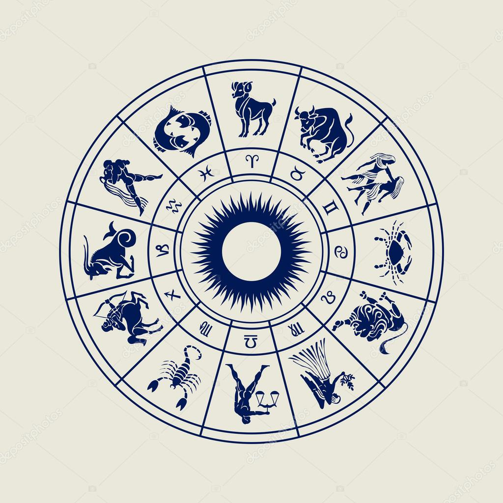

<html>
<html lang="pt-br">
  <head>
    <meta http-equiv="Content-Type" content="text/html; charset=UTF-8">
    <meta name="viewport" content="width=device-width, initial-scale=1, maximum-scale=1.0">
    <meta name="robots" content="max-image-preview:large">
    <link rel="preconnect" href="https://fonts.googleapis.com">
    <link rel="preconnect" href="https://fonts.gstatic.com" crossorigin>
    <link href="https://fonts.googleapis.com/css2?family=Playfair+Display&family=Source+Sans+Pro&display=swap" rel="stylesheet">
    <title></title>
    
    
  </head>
  <body>
        

         
        <h1>Os 12 Signos Do Zodíaco</h1>
        <i>Estudos e Análises Pessoais</i>
         
        
        
& viu-se um grande sinal no céu: uma mulher vestida de sol, e a lua debaixo dos seus pés, e uma coroa de <strong>doze estrelas</strong> sobre a sua cabeça.
         <i> Apocalipse capítulo 12</i>

        
        
O versículo da Bíblia acima mencionado , na visão estudada por <mark><a href="https://pt.m.wikipedia.org/wiki/Edgar_Cayce">Edgar Cayce</a></mark> faz referência as 12 constelações dos signos assim como as 12 tribos de Israel, 12 portas, 12 anjos, 12  fundações, 12 discípulos.

        
        

         
        <h1>1 Áries - Carneiro</h1>
         
        
Nascidos entre <b>21/03 a 20/04</b> 
           Elemento Fogo 
           Ritmo Cardinal (marcado pela tomada de iniciativas na vida pessoal.)  Impulsivo, inquieto, sexual, atraente,
            
           Música representativa (Talking Body - Tove Lo) 
          Artista / cantor com o signo : Lady Gaga 
          Pontos Fracos : Cabeça e Testa 
          Arcano Maior (tarot) : 4 O imperador, Em seu maior significado representa a liderança e posse da matéria, se assemelha como o pai de família e o presidente  
          
          Lema: "A virtude mais elevada, como um halo, circunda a cabeça do Imperador; e somente ele é realmente digno de  praticá-la".  
          Planeta : Marte ♂ 
          Signo oposto complementar: Libra

          
          
          

           
          <h1>2 Touro</h1>
           
          
Preserva oque ja possuí e almeja a segurança material, sabe administrar o dinhero e seus gastos, prático e realista, não mede esforços para conseguir oque quer, procura objetivos realistas para a vida.   
          
          Nascidos entre <b>21/04 a 20/05</b>  Elemento Terra, 
          Ritmo Fixo ( voltado para dentro, para a capacidade de resistir exteriormente aos fatos) 
          teimoso, trabalhador, elegante, metódico
           
          Música representativa ( Work from Home - Fifth Harmony)  
          Famosa com o signo : Rainha Elizabeth 
          Pontos Fracos : Garganta, Pescoço e Boca 
          Arcano Maior : 05 O Papa ( Sacerdote ) Em seu maior significado são as leis, os dogmas, as doutrinas, representado pelos lideres religiosos e pessoas que lideram outras dentro de um segmento.
            
          Frase Popular : Manda quem pode obedece quem tem juízo  
          Planeta : Vênus ♁  
          Signo oposto complementar : Escorpião 
          

         

          
         <h1>3 Gêmeos</h1>
          
         
Alegre, divertido e brincalhão, tem o raciocínio rápido e possuí a melhor 
          comunicação por ser o mais comunicativo
          gosta do oba oba, do pouco compromisso, procura sempre a liberdade, vive em buscas de mudanças e se entedia com facilidade.   
          
          Nascidos entre <b>21/05 a 20/06</b> 
          Elemento Ar, 
          Ritmo Mutável ( Poder de mudança e adaptação).  
          Música representativa (  E essa boca aí ? - Bruninho & Davi)  
          
          Artista / cantor com o signo : Sophia Abrahão  
          Pontos Fracos : Sistema Respiratório,  nervoso e ombros.  
          Arcano Maior : 6 Os Enamorados Em seu maior significado está o livre Arbítrio , as escolhas concientes  
          Referência Bíblica : Adão e Eva e a queda do homem segundo suas escolhas   
          Planeta : Mercúrio ☿  
          Signo oposto complementar : Sagitário 
          

          

           
          <h1>4 Câncer - Caranguejo</h1>
           
          
Busca ser amado quer dar e receber sentimentos verdadeiros ,família está em primeiro lugar, é confiável e sensitivo, busca também a estrutura emocional, tem memória de elefante, maior medo é ser abandonado por quem ama, é de fases assim como a lua pelo qual é regido.   
          
          Nascidos entre <b>21/06 a 21/07</b>  Elemento Água  
          Ritmo Cardinal ( Se relaciona aos sentimentos mais internos)  
          Amoroso, emotivo, rancoroso, intuitivo,  A mãe de família ou a avó que dá dinheiro escondido pros netos.  
          Música representativa ( Umbrella - Rihanna )  
          
          Artista / cantor com o signo : Ariana Grande  
          Pontos Fracos : Estômago e Intestino. 
          
          Arcano Maior : 7 O Carro Em seu maior Significado fala de tomar a iniciativa de ir a frente e conquistar mantendo sempre o equilíbrio, representa também a vitória e poder de ação.  
          Referência bíblica do Arcano : Portanto, tomai toda a armadura de Deus, para que possais resistir no dia mau e, havendo feito tudo, ficar firmes. ( Efésios 6 - 13 ).  
          Planeta : Lua ☽  
          Signo oposto complementar : Capricórnio 
          
 
          

           
          <h1>5 Leão</h1>
           
          
Mantenedor do (ser) o bom lider , é generoso, Regido pelo Sol e por consequência tente a ser o centro das atenções por que chama atenção naturalmente sem forçar nada .    
          Nascidos entre <b>22/07 a 22/08</b>  
          Elemento Fogo  
          Ritmo Fixo  
          Música representativa ( Roar - Katy Perry  )  
          Presidente com o signo : Barack Obama  
            Pontos Fracos : Coração , Costas e Orta.  
            Arcano Maior : 19 O Sol Em seu maior significado representa a felicidade a alegria e a luz  
            Planeta : Sol ☉  
            Signo oposto complementar : Aquário 
          

          

           
          <h1>6 Virgem</h1>
           
          
Nascidos entre <b>23/08 a 22/09</b>  
            Elemento Terra Ritmo Mutável ( Flexibilidade e Adaptação)  
            Organizado, crítico, inteligente, desconfiado, esforçado e pé no cchão 
            Música representativa ( Pesadão - IZA )  
            Artista / cantor com o signo : Cameron Diaz  
            Pontos Fracos : Sistema Digestivo e Pele.  
            Arcano Maior : 9 O Eremita Em seu maior significado este arcano representa o autoconhecimento e a interiorização e a solitude.  
            Planeta : Mercúrio ☿  
            Signo oposto complementar : Peixes 
            
          

          
          

           
          <h1>7 Libra</h1>
           
          
Buscador do conhecimento, possuí raciocínio rápido, é muito inteligente e está sempre em busca de mais, no seu lado negativo pode ser indeciso e inseguro, o simbolo da balança representa a capacidade de olhar para os dois lados.   
          
           Nascidos entre <b>23/09 a 22/10</b> 
           Elemento Ar Ritmo Cardinal ( Buscador do conhecimento) 
           Possuí um poder de atração graças a vênus  
           Música representativa (  Kings & Queens Ava Max )  
          Ator com o signo : Will Smith  
          Pontos Fracos : Rins , Bexiga e Lobar.  
          Arcano Maior : 8 A justiça   
          Referência bíblica do Arcano : "Não vos enganeis: de Deus não se zomba; pois aquilo que o homem semeia, isso também colherá." ( Gálatas, 6:7  )  
          Planeta : Vênus ♁  
          Signo oposto complementar : Áries 
          
          

          

           
          <h1>8 Escorpião</h1>
           
          
Mantenedor dos sentimentos intensos, dominador e possessivo, gosta de uma união com emoção e profundidade, desconfiado e demorar a ceder sua confiança, representado pelas grandes transformações pessoais, a morte do ego o " torna-se gota no oceano ", em seu lado negativo é raivoso , rancoroso, vingativo.    
            
            Nascidos entre <b>23/10 a 21/11</b> 
            Elemento Água  
            Ritmo Fixo
            Considerado um dos signos mais sexuais ,tem olhar marcante e profundo, intuitivo e detetive, sabe de tudo 
              
             Música representativa ( Wrecking Ball - Miley Cyrus )  
            Ator do signo : Leonardo DiCaprio  
            Pontos Fracos : Órgãos Sexuais  
            Arcano Maior : 13 A Morte Em seu maior significado está as transformações pessoais intensas. 
            Referência bíblica do Arcano : "Ó Morte, onde está o teu aguilhão? Ó túmulo, onde está a tua vitória?" (Coríntios,15:55 )  
            Níveis De Transformações Do Signo : <b>Escorpião - largato cinza - Águia e Fênix.</b>  
            Planeta : Plutão ♇  
            Signo oposto complementar : Touro
          

          

           
          <h1>9 Sagitário</h1>
           
          
Distribuidor do ser, está sempre em busca de religar se com sigo próprio, tem uma forte voz interior, assim como sentauro está sempre ligado com seus instintos.    
            
            Nascidos entre <b>22/11 a 21/12</b>  
            Elemento Fogo  
            
            Ritmo Mutável  
            
            Livre e Aventureiro, debochado, convencido, otimista.  
            Música representativa ( Bebaça -  Marília Mendonça )  
            Cantora com o signo : Britney Spears  
            Pontos Fracos : Pernas , Quadril e Pâncreas  
            Arcano Maior  : 14 A Temperança Em seu maior significado está o equilíbrio entre as emoções e o mundo material, paciência e serenidade.  
            Lema: "Um anjo inclina-se diante de vós, E faz com que vos ergais; E , cheios de alegria, vedes, diante de vós, a Terra Prometida." Novalis (Frh.v. Hardenberg)   
            Planeta : Júpiter ♃  
            Signo oposto complementar : Gêmeos 
          
          

          

           
          <h1>10 Capricórnio</h1>
           
          
Buscador da matéria, busca concretizar seus objetivos de vida, o trabalho, esforço e a disciplina são seus sobrenomes, é econômico e prático e sempre esta em seu autocontrole.    
          
           Nascidos entre <b>22/12 a 20/01</b>  Elemento Terra 
           Ritmo Cardinal  
           Disciplinado , Econômico, possessivo, controlador, prático, Famoso(a) homen/mulher do dinheiro. 
           Música  representativa ( Fetty Wap ‑ Trap Queen ).  
          Atriz com o signo : Larissa Manoela  
          Pontos Fracos : Coluna , Ossos e Joelhos 
          Arcano Maior : 15 Opositor  
          Planeta : Saturno ♄  
          Signo oposto complementar : Câncer 
          

          

           
          <h1>11 Aquário</h1>
           
          
Mantenedor do conhecimento, quer manter oque ja sabe e defender seuas idéias e pontos de vista, tem o raciocínio rápido l, inteligente e sempre tem uma opinião formada sobre tudo, humanitário e social, livre e independente, imune a chantagens emocionais, geralmente vive a vida solteiro e não tem filhos.   
          
          Nascidos entre <b>21/01 a 19/02</b> 
          Elemento Ar  
          Ritmo Fixo  
         Música representativa ( Let It Go ‑ Demi Lovato )  
          Cantor com o signo : Shakira  
          Pontos Fracos : Panturrilha e Pulmão  
          Arcano Maior : 17 A Estrela Em seu maior significado está a esperança e a cura interior  
          
          Referência bíblica do Arcano : "Que haja um firmamento no meio das águas, e que ele separe as águas das águas. E Deus... separou as águas que estavam debaixo do firmamento das águas que estavam em cima do firmamento." ( Gênesis 1:6,7 )  
          Planeta : Urano ♅  
          Signo oposto complementar : Leão 
          

          
          

           
          <h1>12 Peixes</h1>
           
          
Distribuidor dos sentimentos, oque procura aliviar o sofrimento alheio, possui um nivel de profundidade espiritual grande, consegue enxergar o caráter ilusório deste mundo material, o piciano evoluido tem sua posição como a de um salvador, esta entre o mundo material e o espíritual, é altamente sensível.    
          
          Nascidos entre <b>20/02 a 20/03</b>  Elemento Água   
            Ritmo Mutável  
            Representado pelo cargo de pastor ou a pessoa que faz caridades.  
            Música representativa ( O Escudo ‑ Voz Da Verdade )  
            Cantor com o signo : Luan Santana  
            Pontos Fracos : Pés, tornozelos , mental e emocional  
            Arcano Maior : 18 A lua   
            Lema: "Existe uma maré nos casos dos homens a qual, levando à inundação, nos encabeça à fortuna. está restrita em sombras e misérias. Em um mar tão cheio estamos agora a flutuar. " Shakespeare.  
            Planeta : Netuno ♆   
            Mediunidade trazida pelo planeta regente : Clarevidência   
            Signo oposto complementar : Virgem
          

           
          

           
          <h1>Nota complementar</h1>
           
          
Todas as informações da pagina foram
          revisadas por min sendo aproveitas do curso de Astrológia Uma Estrada Para O Autoconhecimento criado e lecionado pelo professor Danilo Manfrin Astrólogo, sendo adicionadas informações de conhecimentos prévios meus.

          
            
          
<b>© Vitor Olivera | GitHub Pages Última atualização em 02/12/2022, atenção: página disponível somente na versão móvel.</b>

          

  </body>
</html>
